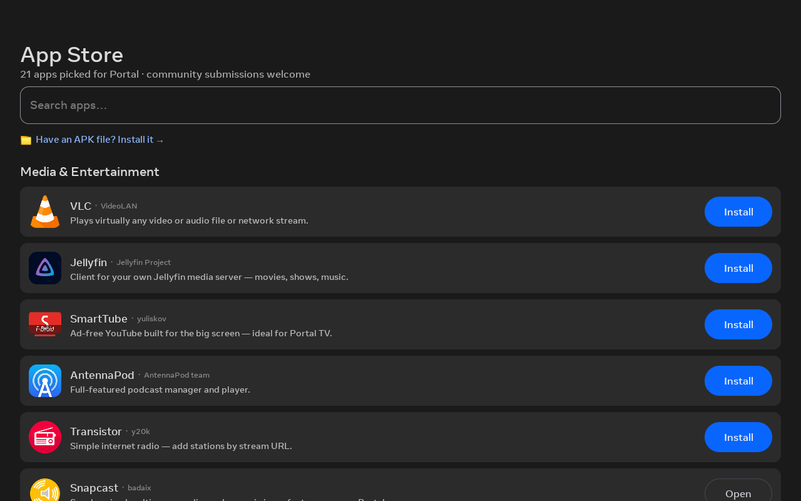

# App Store

`StoreActivity` / `StoreCatalog` — an on-device app store backed by a hosted JSON catalog.

## What it is

A hosted catalog ([`catalog.json`](https://github.com/starbrightlab/immortal/blob/main/catalog.json),
schema v2) rendered with app icons, search, and per-app detail pages (author, source, website,
credit). It shows **device-compatibility badges** and an **"Updates"** section for installed
apps.

- **F-Droid entries** resolve the current APK at install time, so the catalog never goes stale.
- **Your own apps** use a direct `apkUrl`.
- A **bundled copy** of the catalog ships in the app as an offline fallback.

## Installing apps

Installs go through Android's standard `PackageInstaller`. On the
[first-gen Portal](../first-gen-portals.md), whose built-in installer dialog is broken, the
provisioning kit's overlay fix makes that dialog usable (and the fix persists across reboots),
so the store just works.

Two extra entry points catch APKs from elsewhere:

- **"Install with Immortal"** (`ApkInstallActivity`) — catches any APK you open from Chrome or a
  file manager.
- **"Install an APK"** (`ApkBrowserActivity`) — lists APKs already in your Downloads.

!!! tip "Other ways to install"
    For Play-Store apps (Aurora), F-Droid, and sideloading, see the
    [Installing apps & app stores guide](../guides/installing-apps.md).

## Self-update

Immortal updates itself the same way: `UpdateManager` polls
[`version.json`](https://github.com/starbrightlab/immortal/blob/main/version.json) and installs a
newer build over itself — no cable, no laptop. See [Releasing](../releasing.md).

## Open to the community

The store is open to community submissions, and every catalog PR is CI-validated. Built a Portal
app? See [Submitting an app](../submitting-apps.md).
