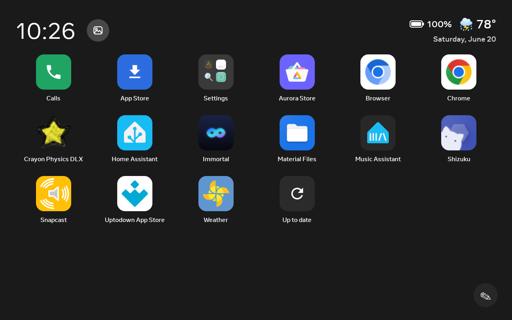

# Launcher

`HomeActivity` — the home screen that replaces the Portal's stock launcher.

A fullscreen app grid with a clock/date/weather header and an optional charge indicator
(shown only on the Portal Go, which has a battery). It's designed for a landscape touchscreen
and is fully navigable by remote on the [Portal TV](portal-tv.md).

## The grid

- **App grid** — your installed apps, fullscreen.
- **Folders** — in Manage mode, drag one app onto another to make a folder. Name them, rename
  them, and drag apps back out, just like a phone.
- **Manage mode** — remove apps (tap the ✕) and organise the grid.

## Header

- **Clock / date / weather** — weather is keyless (Open-Meteo + IP geolocation).
- **Now-playing mini-player** — a compact cover-art + play/pause control that appears whenever
  something is playing on the device, sourced from the device's own media session
  (`NowPlayingHub`). It stays out of the way when nothing's playing. See
  [Multi-room audio & now-playing](multi-room-audio.md).
- **App switcher** — a top-bar control (`AppSwitcherActivity`) that lists your recently-used
  apps so you can hop between them without returning to the grid.
- **"hey" voice button** — an optional mic button for push-to-talk to your voice assistant. It
  appears only when the companion wake-word app is explicitly enabled and installed, and is
  supported on **first-gen Portals only** — see [Alexa & voice](../guides/voice-alexa.md).

## Tiles

- **Screensaver** button (top-left) — jump straight into the [photo frame](screensaver.md).
- **Manage** button (bottom-right) — enter Manage mode.
- **Calls** tile — a green tile that bridges to the stock dialer/contacts for WhatsApp and
  Messenger calling.
- **Help** tile — a friendly, non-technical [walkthrough](#help-tour).

## Help tour

`HelpActivity` is a friendly, non-technical walkthrough shown on a Help tile (and once on first
launch), so anyone can pick up a revived Portal without instructions.
