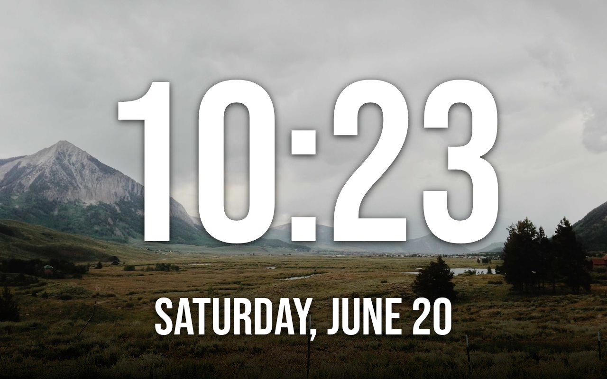

# Screensaver & photo frame

`PhotoDreamService` / `PhotoFrameController` — a photo frame with stock-style
clock/battery/date/weather widgets that doubles as the Portal's screensaver.

Swipe to change photos, tap to exit.

## Clock faces

Choose a screensaver clock face from a face picker (`FacePickerActivity`): **flip clock**,
**big**, **bold**, or **minimal**, each with size options.

## Digital-clock screensaver

`DigitalClockConfig` / `DigitalClockDreamService` — an alternative screensaver that shows a large,
customisable clock **instead of** the photo frame. Turn it on from the **Clock** settings screen
(`ClockSettingsActivity`) and Immortal swaps the active screensaver to it automatically; a
non-drag tap exits.

- **Style** — classic, flip, bold, neon, seven-segment, or analog.
- **Colour**, **font**, **size**, **position**, **background**, and **glow** — all pickable, with a
  live preview. Show the date and/or seconds as you like.
- Anti-burn-in slowly drifts the clock so a static display doesn't mark the panel.

With this off, the screensaver is the [photo frame](#photo-sources) below; with it on, it's the
clock. Everything else on this page (overnight behaviour, presence, welcome overlay) applies to
whichever is showing.

## Photo sources

Point the frame at whatever you like — most sources can be set up **from your phone** (pair the
[phone remote](remote.md) via its QR code, then use its *Set up photo source & calendar* panel), so
you don't type URLs and credentials on the Portal:

| Source | Notes |
| --- | --- |
| Your own folder | Photos **and** videos from the device's own storage. EXIF rotation is honoured. |
| iCloud shared album | Paste a shared-album link (supports Apple's newer CloudKit link format). |
| [Immich](https://immich.app/) | A self-hosted photo library. |
| Network share (SMB) | A file server on your LAN. |
| WebDAV | Any WebDAV server. |
| Web page | Pull images from any web page. |
| Built-in feed | Keyless (Lorem Picsum; Unsplash-ready with a key). Requests photos at the device's actual resolution/orientation so they're sharp on every model. |

## Presence-aware behaviour

The screensaver cooperates with the Portal's camera-based presence detection so it can run as a
**permanent frame** while someone's around (and on mains power). On the battery-powered
**Portal Go**, an optional "sleep when nobody's around" setting saves power.

Immortal can't read Meta's presence signal directly (see
[Hardware limitations](../limitations.md)), so it infers presence from the system's own
dream/sleep lifecycle. The design notes go deep on this:
[Multi-room audio → Presence](../design/multi-room-audio.md).

## Overnight night clock

During an overnight window the screensaver can show a **dimmed clock** instead of going fully
dark — and a deliberate tap inside the window wakes the device for normal use, returning to
sleep a short while after you stop interacting.

## Welcome-back overlay

When the screensaver starts, Immortal can show a brief **welcome-back overlay**
(`WelcomeConfig`) — a time-of-day greeting ("Good morning", optionally with your name), the clock,
and the date, optionally spoken aloud. It auto-dismisses after a few seconds. Turn it on with the
**Welcome screen** toggle in the screensaver's Display settings, and tune the greeting, name, and
timing on the **Welcome** settings screen (`WelcomeSettingsActivity`).

## Ambient almanac & calendar packs

The photo frame's dashboard can carry an **ambient almanac** line — a quiet daily fact fed by
installable, keyless, on-device **calendar packs** plus a quote of the day (`CalendarPacks`,
rendered by `PhotoFrameController`). Switch packs on per household under **More features → Almanac**
on the [Settings](launcher.md#settings) screen (all off by default):

| Pack | Adds |
| --- | --- |
| **Romanian name-days & Orthodox feasts** | Today's Orthodox feast and the name-days for the day. |
| **Irish holidays** | Bank holidays and saints' days (St Patrick's, St Brigid's…). |
| **Prayer times** | The next daily Islamic prayer time for your location. |

Each pack contributes a line only when it has something for the day, and everything is computed
on-device — no keys, no accounts.
