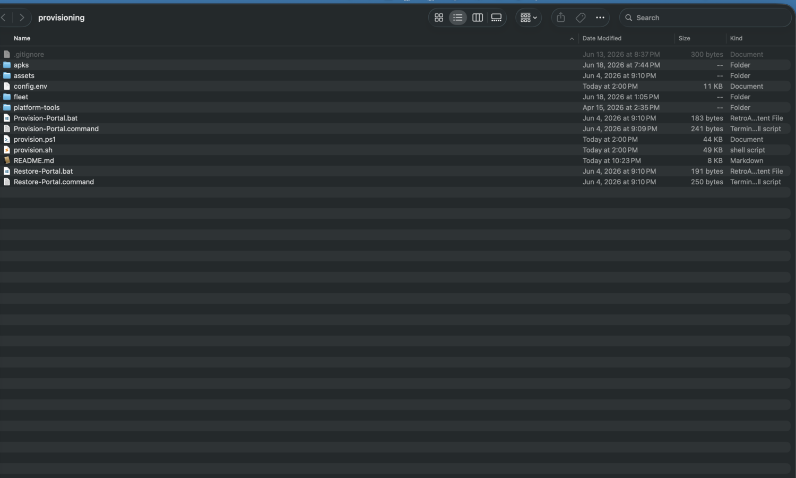
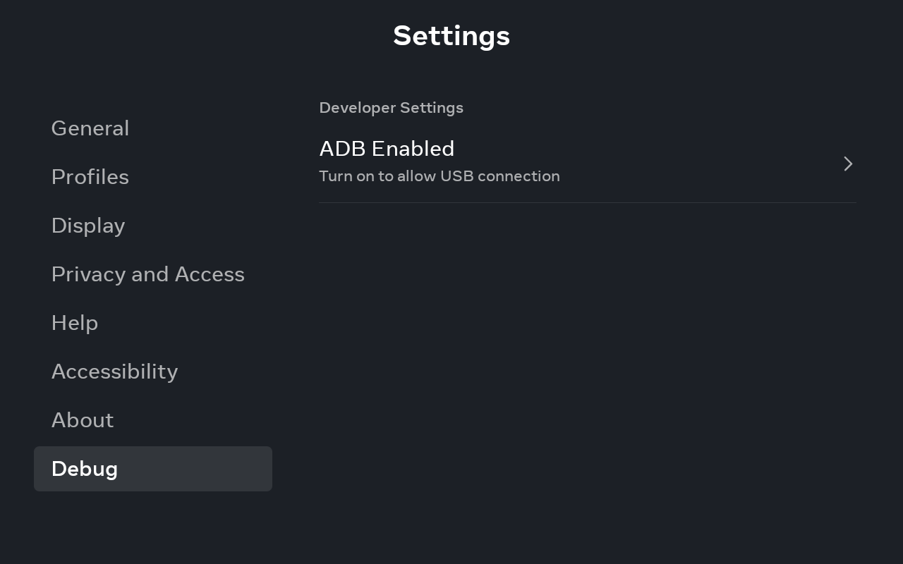

# Provisioning a Portal

**Provisioning** is the one-time setup that turns a stock Meta Portal into an Immortal device.
You plug the Portal into a computer with a USB-C cable, double-click one file, and tap **Allow**
once on the Portal — the kit does the rest. It's a single per-device step, and everything it does
is **reversible**.

!!! tip "The short version"
    1. [Download the kit](#step-1-download-the-kit) and open the `provisioning` folder.
    2. [Unblock the files](#step-2-unblock-the-files-first-time-only) (first time only).
    3. On the Portal, enable **Settings → Debug → ADB Enabled**.
    4. Connect the Portal over **USB-C**.
    5. Double-click **`Provision-Portal`** and tap **Allow** on the Portal.
    6. Wait for **"Done."** — the Portal switches to the Immortal home screen.

!!! success "No technical skills required"
    You don't need a terminal, and you don't need to install Android developer tools. If `adb`
    isn't on your computer, the kit **downloads Google's official platform-tools automatically**.
    It also **fetches the latest Immortal release on its own**, so there's no separate app file to
    download.

## What you'll need

- A **Meta Portal** (any model — Portal, Portal+, Portal Go, Mini, or Portal TV).
- A **computer** running macOS or Windows. (Linux works too — use the `.command`/`.sh` files.)
- A **USB-C cable that carries data** — not a charge-only cable. This is the single most common
  snag; see [Troubleshooting](#troubleshooting).
- About **10 minutes**.

## Step 1 — Download the kit

The provisioning kit lives in the repository's `provisioning/` folder. To get it:

1. Go to the [Immortal repository](https://github.com/starbrightlab/immortal).
2. Click the green **Code** button → **Download ZIP** (or, on the
   [Releases page](https://github.com/starbrightlab/immortal/releases), download **Source code
   (zip)** under the latest release).
3. Unzip it and open the **`provisioning`** folder.

Inside you'll find:

| File | What it's for |
| --- | --- |
| `Provision-Portal.command` (macOS/Linux) | Double-click to provision |
| `Provision-Portal.bat` (Windows) | Double-click to provision |
| `Restore-Portal.command` / `.bat` | Double-click to undo |
| `config.env` | Optional settings (sensible defaults — most people never touch it) |



## Step 2 — Unblock the files (first time only)

Operating systems flag files downloaded from the internet. Clear that once:

=== "macOS"

    macOS may say the file is *"from an unidentified developer"* or *"cannot be verified"*.

    - **Easiest:** right-click `Provision-Portal.command` → **Open** → **Open** again. You only do
      this the first time.
    - If macOS still refuses, go to ** → System Settings → Privacy & Security**, scroll down, and
      click **Open Anyway**.
    - Or clear the quarantine flag in one go (Terminal, inside the folder):

        ```bash
        xattr -d com.apple.quarantine Provision-Portal.command Restore-Portal.command
        ```

=== "Windows"

    Windows marks downloaded files as **blocked**, which makes the script error out or flash and
    close immediately.

    - **Easiest:** right-click the `provisioning` folder → **Properties** → tick **Unblock** at the
      bottom → **OK**.
    - Or, in PowerShell from inside the folder, unblock everything at once:

        ```powershell
        Get-ChildItem -Recurse | Unblock-File
        ```

## Step 3 — Enable ADB on the Portal

On the Portal itself, open **Settings → Debug → ADB Enabled** and turn it on. This lets the
computer talk to the Portal over the cable.

!!! question "Can't find the Debug menu?"
    The exact path varies slightly by model and software version — look under **Settings** for
    **Debug**, **Developer**, or **System**. It's a one-time toggle; once on, it stays on.



## Step 4 — Connect the Portal

Plug the Portal into your computer with the **USB-C data cable**. Nothing needs to happen on screen
yet.

## Step 5 — Run it

Double-click the file for your OS:

=== "macOS / Linux"

    Double-click **`Provision-Portal.command`**. A Terminal window opens and prints each step as it
    runs.

=== "Windows"

    Double-click **`Provision-Portal.bat`**. A console window opens and prints each step as it runs.

A console window scrolling through steps like *Installing client APK*, *Granting permissions*, and
*Setting launcher* is **normal** — leave it running.

Within a few seconds, the **Portal shows a "Allow USB debugging?" prompt**. Tap **Allow**, and tick
**"Always allow from this computer"** so you won't be asked again.

## Step 6 — Answer the questions it asks

Most of the run is automatic, but it may pause to ask a few things (just type your answer and press
Enter):

| Prompt | What it means | Suggested answer |
| --- | --- | --- |
| **Block Meta OS updates?** | Stops a future Meta update from silently undoing your setup. The Portal is discontinued, so you give up only unlikely future patches. | **Yes** (default) |
| **Restore Amazon Alexa?** *(first-gen only)* | Revives the original Alexa client. The always-on "Hey Alexa" wake word is a separate opt-in because it can interfere with Messenger call audio on some Gen-1 hardware. See the [Alexa & voice guide](guides/voice-alexa.md). | Your call — `y` to set up Alexa |
| **Device name** *(only with `--fleet`)* | A friendly name for [fleet management](features/fleet.md), e.g. "Living Room". | Whatever you like |

If you don't want to be asked at all, you can preset these in `config.env` (see
[Customising](#customising-and-advanced)).

## Done — and how to check it worked

When you see **"Done."**, provisioning is complete. The Portal should switch to the **Immortal home
screen**, and its screensaver becomes the Immortal photo frame.

To double-check at any time, you can run a status report:

=== "macOS / Linux"

    ```bash
    ./provision.sh --status
    ```

=== "Windows"

    ```powershell
    powershell -ExecutionPolicy Bypass -File provision.ps1 -Status
    ```

That prints the current home screen, screensaver, install state, and which client app is set.

!!! info "First-gen Portal+ and Portal TV"
    On these Android 9 models the kit also repairs the broken installer dialog automatically, and
    the fix survives reboots — so the App Store and sideloading just work afterward. Details:
    [First-gen Portals](first-gen-portals.md).

**That's it — the cable is no longer needed.** From here Immortal installs and updates apps on its
own, and updates itself over the air.

## Troubleshooting

??? failure "Nothing happens / 'no devices found' / 'device not found'"
    In order of likelihood:

    1. **Charge-only USB cable.** Many USB-C cables only carry power. Swap to one you know transfers
       data (e.g. the one a phone came with).
    2. **ADB isn't enabled** on the Portal — see [Step 3](#step-3-enable-adb-on-the-portal).
    3. **Re-seat the cable** at both ends, and try a different USB port on the computer.

??? failure "'unauthorized' or the run stops waiting"
    You didn't approve the **"Allow USB debugging?"** prompt on the Portal. Unplug and replug the
    cable, watch the Portal screen, and tap **Allow** (tick **Always allow**). Then re-run.

??? failure "macOS: 'cannot be opened because it is from an unidentified developer'"
    Right-click the file → **Open** → **Open**. If macOS still blocks it, go to
    **System Settings → Privacy & Security → Open Anyway**, or clear the quarantine flag — see
    [Step 2](#step-2-unblock-the-files-first-time-only).

??? failure "Windows: the window flashes and closes, or shows a parsing error"
    The downloaded files are still **blocked**. Unblock them (Properties → Unblock, or
    `Get-ChildItem -Recurse | Unblock-File`) — see [Step 2](#step-2-unblock-the-files-first-time-only).

??? failure "'adb not found' and it can't download tools"
    The kit downloads Google's platform-tools automatically, so this usually means **no internet
    access** (or a restrictive network/proxy) on the computer. Connect to a normal network and
    re-run, or install Android platform-tools manually so `adb` is on your `PATH`.

??? failure "It finished, but the Portal didn't change to the Immortal home"
    Re-run provisioning. If you intentionally set `SET_LAUNCHER=false`, Immortal installs as a
    normal app instead of the home screen — open it from the stock home.

??? failure "More than one Android device is connected"
    The kit expects a single Portal. Disconnect other phones/tablets and re-run.

## Restoring

To undo everything, double-click **`Restore-Portal`** (`.command` / `.bat`), or run
`./provision.sh --restore`. It puts the **original launcher and screensaver back**, re-enables the
package verifier and OS updates, and re-enables the first-gen installer overlay.

The Immortal app itself is left installed (remove it with `adb uninstall com.immortal.launcher` if
you want). Some screen-off **device-admin** removal has to be finished on the Portal — restore tells
you exactly when and how, rather than pretending it did something Android won't allow from a script.

## Customising and advanced

Most people never need this — the defaults are sensible. But every step is configurable in
[`config.env`](https://github.com/starbrightlab/immortal/blob/main/provisioning/config.env):

| Setting | Default | What it does |
| --- | --- | --- |
| `SET_LAUNCHER` | on | Replace the system home with Immortal (reversible). |
| `SET_SCREENSAVER` | on | Set Immortal's photo frame as the screensaver. |
| `DISABLE_VERIFIER` | on | Disable Meta's package verifier, which otherwise blocks on-device installs. |
| `DISABLE_INSTALLER_OVERLAY` | on | Fix the [Gen-1 white-on-white installer dialog](first-gen-portals.md). API < 29 only. |
| `DISABLE_OTA` | ask | Block Meta OS updates so an OTA can't undo the setup. |
| Shizuku | installed | Privileged broker — useful for [Aurora's silent installs](guides/installing-apps.md). |
| `BOOT_APPS` | MA player | Apps to relaunch after a reboot (also editable in Settings → Start on boot). |
| `ENABLE_FLEET` | off | Opt-in always-on WiFi [management agent](features/fleet.md). |

On the first run the kit snapshots the device's real stock launcher and screensaver to
`/sdcard/immortal_restore.env`, so `--restore` puts the correct components back on any Portal model.

### Command-line flags

```bash
./provision.sh                 # full provision (default)
./provision.sh --status        # report current home / screensaver / install state
./provision.sh --restore       # undo everything
./provision.sh --overlay-fix   # apply just the Gen-1 dialog fix
./provision.sh --apps          # run only the "pre-install apps" step
./provision.sh --shizuku       # (re)start the Shizuku server
./provision.sh --fleet         # enable the WiFi fleet agent on this device
./provision.sh --alexa         # restore Alexa (first-gen) — see the voice guide
./provision.sh --wifi-adb      # enable raw adb-over-WiFi on demand
```

On Windows the same flags are PowerShell switches, e.g. `provision.ps1 -Status`, `-Restore`,
`-OverlayFix`.

!!! note "In-kit reference"
    The kit ships its own
    [`provisioning/README.md`](https://github.com/starbrightlab/immortal/blob/main/provisioning/README.md)
    with the same details for people who only have the downloaded folder in front of them.
